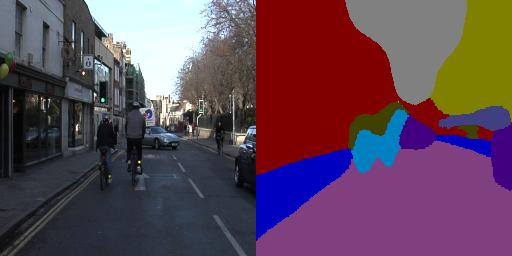
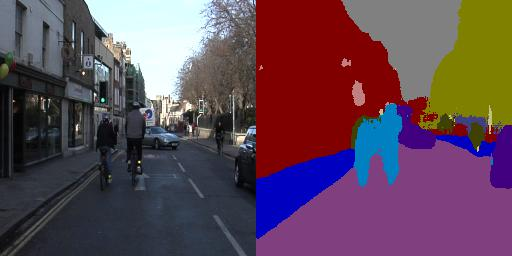
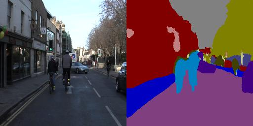
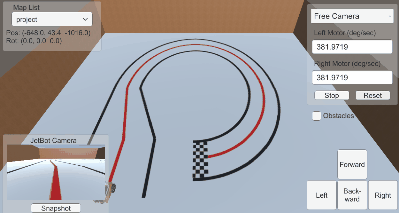

<!--
*** Thanks for checking out the Robotic-Navigation. If you have a suggestion
*** that would make this better, please fork the repo and create a pull request
*** or simply open an issue with the tag "enhancement".
*** Thanks again! Now go create something AMAZING! :D
***
*** To avoid retyping too much info. Do a search and replace for the following:
*** github_username (that is "windsuzu"), repo_name (that is "Robotic-Navigation"), Robot Navigation, project_description
-->

<!-- [![Issues][issues-shield]][issues-url] -->
[![Contributors][contributors-shield]][contributors-url]
[![MIT License][license-shield]][license-url]
[![PR Welcome][pr-welcome-shield]](#contributing)
[![Author][author-shield]][author-url]
[![LinkedIn][linkedin-shield]][linkedin-url]

<!-- PROJECT LOGO -->
 

  

  <h3 align="center">Robot Navigation</h3>

  

    This repo implemented the core technology of the self-driving car, including the basic concepts such as path tracking, path planning, SLAM, etc., and deep learning techniques such as computer vision and reinforcement learning. Finally, we practiced with NVIDIA JetBot in both the simulator and the real world.
     
    <a href="https://github.com/windsuzu/Robotic-Navigation">View Demo</a>
    ·
    <a href="https://github.com/windsuzu/Robotic-Navigation/issues">Report Bug</a>
    ·
    <a href="https://github.com/windsuzu/Robotic-Navigation/issues">Request Feature</a>
  

Table of Contents

* [About](#about)
* [Lab](#lab)
  * [Lab 1 - Kinematic Model & Path Tracking Control](#lab-1---kinematic-model--path-tracking-control)
  * [Lab 2 - Path Planning](#lab-2---path-planning)
  * [Lab 3 - SLAM](#lab-3---slam)
  * [Lab 4 - ORB-SLAM on JetBot](#lab-4---orb-slam-on-jetbot)
  * [Lab 5 - Semantic Segmentation](#lab-5---semantic-segmentation)
  * [Lab 6 - Model-Free Reinforcement Learning for Mapless Navigation](#lab-6---model-free-reinforcement-learning-for-mapless-navigation)
* [JetBot](#jetbot)
  * [Simulation](#simulation)
  * [Real World](#real-world)
* [Contributing](#contributing)
* [License](#license)
* [Contact](#contact)

---

<!-- ABOUT THE PROJECT -->
## About

<table>
<tr>
<td>

本專案為成功大學  Robotic Navigation and Exploration (CS562000) 的課程整理；目標為了解自駕車原理，最終能夠使用影像辨識技術操縱 NVIDIA JetBot。專案細分為 6 個實作的 lab，以及最終 NVIDIA JetBot 的模擬與真實世界模型。

The key features of **Robotic Navigation**:

- Kinetic Model (WMR Model, Bicycle Model)
- Path Tracking (PID Control, Pure-Pursuit Control, Stanley Control)
- Path Planning (A* Algorithm, RRT Algorithm, RRT* Algorithm)
- SLAM (Fast-SLAM, ORB-SLAM)
- Semantic Segmentation (Encoder-Decoder, FCN, UNet, PSPNet)
- Reinforcement Learning (DDPG)

Built With

 

* Python 3
* OpenCV 2
* Numpy
* PyTorch

</td>
</tr>
</table>

---

## Lab

### Lab 1 - Kinematic Model & Path Tracking Control

在 Lab 1 我們要完成兩種 Kinematic Model 的 update 程式碼，分別是 `Bicycle Model` 以及 `WMR (wheeled mobile robot) Model`。 接著，基於這兩種模型，完成三種路線追蹤演算法，分別為 `PID Control`、`Pure Pursuit Control`，以及 `Stanley Control`。

- 題目要求: [lab1.pdf](lab1/lab1.pdf)
- 題目解釋: [lab1-hint.pdf](lab1/lab1_hint.pdf)
- 完整程式碼: [lab1/program/](lab1/program/)
- 成果展示 (點擊截圖查看程式碼): 

| WMR Model (WASD Control)                                                     | WMR PID                                                                               | WMR Pure Pursuit                                                                                        |
| ---------------------------------------------------------------------------- | ------------------------------------------------------------------------------------- | ------------------------------------------------------------------------------------------------------- |
|  |  |  |

| Bicycle Model (WASD Control)                                                         | Bicycle Pure Pursuit                                                                                            | Bicycle Stanley                                                                                       |
| ------------------------------------------------------------------------------------ | --------------------------------------------------------------------------------------------------------------- | ----------------------------------------------------------------------------------------------------- |
|  |  |  |

---

### Lab 2 - Path Planning

在 Lab 2 我們要實作路徑規劃 (Path Planning) 的演算法，這些演算法的目標通常為找到起點與終點的最佳路徑；我們總共有 3 個需要實作的算法，分別為 `A* algorithm`、`RRT algorithm`，以及 `RRT* algorithm`。

- 題目要求: [lab2.pdf](lab2/lab2.pdf)
- 題目解釋: [lab2-hint.pdf](lab2/lab2_hint.pdf)
- 完整程式碼: [lab2/program/](lab2/program/)
- 成果展示 (點擊截圖查看程式碼): 

| A* algorithm                                                                          | RRT algorithm                                                                 | RRT* algorithm                                                                          |
| ------------------------------------------------------------------------------------- | ----------------------------------------------------------------------------- | --------------------------------------------------------------------------------------- |
|  |  |  |

---

### Lab 3 - SLAM

在 Lab 3 我們要實作 `Fast-SLAM` (simultaneous localization and mapping)，一種 SLAM 的變形。所謂 SLAM 是一種概念，通過車子感測器所偵測到的地標特徵，來定位車子自身的位置和狀態，一次達到定位與地圖建構的目標。

- 題目要求與解釋: [lab3.pdf](lab3/lab3.pdf)
- 完整程式碼: [lab3/program/](lab3/program/)
- 成果展示 (點擊截圖查看程式碼): 

| Fast SLAM                                                                        |
| -------------------------------------------------------------------------------- |
|  |

---

### Lab 4 - ORB-SLAM on JetBot

在 Lab 4 我們要在 JetBot 上實作 `ORB-SLAM 2`，利用 JetBot 的照相機來偵測現實世界的地標座標。要達成該目標，我們必須將 ORB-SLAM library (C++) 與 JetBot 上的 Python 環境進行綁定；接著使用 JetBot 的照相機收集棋盤照片，對 JetBot 進行校正 (`Camera Calibration`)。

- 題目要求與解釋: [lab4.pdf](lab4/lab4.pdf)
- 完整程式碼: [lab4/program/](lab4/program/)
- 成果展示 (點擊截圖查看程式碼): 

| ORB-SLAM on JetBot                                                               |
| -------------------------------------------------------------------------------- |
|  |

---

### Lab 5 - Semantic Segmentation

在 Lab 5 我們要在 PyTorch 上實作影像分割 (`Image Segmentation`) 中的語義分割 (`Semantic Segmentation`)，也就是對該張圖片的每一個像素點都進行分類。我們使用四種常見的模型來實作，分別為 `Encoder-Decoder`、`Fully Convolution Network (FCN)`、`UNet`，以及 `PSPNet`。

- 題目要求與解釋: [lab5.pdf](lab5/lab5.pdf)
- 完整程式碼: [lab5/program/](lab5/program/)
- 成果展示 (點擊截圖查看程式碼): 

|                                   Encoder-Decoder                                    |                                          FCN                                          |
| :----------------------------------------------------------------------------------: | :-----------------------------------------------------------------------------------: |
|  |  |
|                                       **UNet**                                       |                                      **PSPNet**                                       |
|   |  |

---

### Lab 6 - Model-Free Reinforcement Learning for Mapless Navigation

在 Lab 6 我們要使用強化學習 (`Reinforcement Learning，RL`) 來取代所有在 lab1、lab2、lab3 執行的工作。原本為了讓車子從任意起點走到任意終點，需要以 SLAM 等演算法建立地圖，接著執行路徑規劃以及路徑追蹤才能完成；但強化學習能夠跳過這些步驟，以獎勵方式來學習達成目標。在 Lab 6 中所使用的 RL 為 `DDPG (Deep Deterministic Policy Gradient)`。

- 題目要求與解釋: [lab6.pdf](lab6/lab6.pdf)
- 完整程式碼: [lab6/program/](lab6/program/)
- 成果展示 (點擊截圖查看程式碼): 

| Training Loop 50                                                       | Training Loop 450                                                      | Training Loop 750                                                      |
| ---------------------------------------------------------------------- | ---------------------------------------------------------------------- | ---------------------------------------------------------------------- |
|  |  |  |

---

## JetBot

對 JetBot 的實作將依環境分為 Unity 模擬與真實世界。在這兩個環境中，我們都需要達成三項任務: 追蹤紅線 (Tracking)、躲避障礙物 (Avoidance)，以及終點線停車 (Parking)。

- 題目要求與解釋: [jetbot.pdf](jetbot/jetbot.pdf)

### Simulation

- 完整程式碼以及解釋: [jetbot/program/sim/](jetbot/program/sim/)
- 成果展示 (點擊截圖查看程式碼): 

| Simulation - Tracking                                                           | Simulation - Avoidance                                                           |
| ------------------------------------------------------------------------------- | -------------------------------------------------------------------------------- |
|  |  |

### Real World

- 完整程式碼: [jetbot/program/real/](jetbot/program/real/)
- 成果展示 (點擊截圖查看程式碼): 

| Real World - Tracking                                                                    | Real World - Avoidance                                                                        |
| ---------------------------------------------------------------------------------------- | --------------------------------------------------------------------------------------------- |
|  |  |

---

## Contributing

Contributions are what make the open source community such an amazing place to be learn, inspire, and create. Any contributions you make are **greatly appreciated**.

1. Fork the Project
2. Create your Feature Branch (`git checkout -b feature/AmazingFeature`)
3. Commit your Changes (`git commit -m 'Add some AmazingFeature'`)
4. Push to the Branch (`git push origin feature/AmazingFeature`)
5. Open a Pull Request

## License

Distributed under the MIT License. See [LICENSE](https://github.com/windsuzu/Robotic-Navigation/blob/main/LICENSE) for more information.

## Contact

Reach out to the maintainer at one of the following places:

* [GitHub discussions](https://github.com/windsuzu/Robotic-Navigation/discussions)
* The email which is located [in GitHub profile](https://github.com/windsuzu)

[contributors-shield]: https://img.shields.io/github/contributors/windsuzu/Robotic-Navigation.svg?style=for-the-badge
[contributors-url]: https://github.com/windsuzu/Robotic-Navigation/graphs/contributors
[issues-shield]: https://img.shields.io/github/issues/windsuzu/Robotic-Navigation.svg?style=for-the-badge
[issues-url]: https://github.com/windsuzu/Robotic-Navigation/issues
[license-shield]: https://img.shields.io/github/license/windsuzu/Robotic-Navigation.svg?style=for-the-badge&label=license
[license-url]: https://github.com/windsuzu/Robotic-Navigation/blob/main/LICENSE.txt
[linkedin-shield]: https://img.shields.io/badge/-LinkedIn-black.svg?style=for-the-badge&logo=linkedin&colorB=555
[linkedin-url]: https://linkedin.com/in/windsuzu
[pr-welcome-shield]: https://shields.io/badge/PRs-Welcome-ff69b4?style=for-the-badge
[author-shield]: https://shields.io/badge/Made_with_%E2%9D%A4_by-windsuzu-F4A92F?style=for-the-badge
[author-url]: https://github.com/windsuzu
