<!--
*** Thanks for checking out the Robotic-Navigation. If you have a suggestion
*** that would make this better, please fork the repo and create a pull request
*** or simply open an issue with the tag "enhancement".
*** Thanks again! Now go create something AMAZING! :D
***
*** To avoid retyping too much info. Do a search and replace for the following:
*** github_username (that is "windsuzu"), repo_name (that is "Robotic-Navigation"), Robot Navigation, project_description
-->

<!-- [![Issues][issues-shield]][issues-url] -->
[![Contributors][contributors-shield]][contributors-url]
[![MIT License][license-shield]][license-url]
[![PR Welcome][pr-welcome-shield]](#contributing)
[![Author][author-shield]][author-url]
[![LinkedIn][linkedin-shield]][linkedin-url]

<!-- PROJECT LOGO -->
 

  <a href="https://github.com/windsuzu/Robotic-Navigation">
    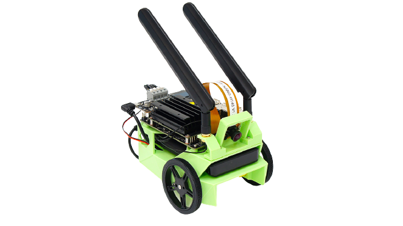
  </a>

  <h3 align="center">Robot Navigation</h3>

  

    Robot Navigation
     
    <a href="https://github.com/windsuzu/Robotic-Navigation">View Demo</a>
    ·
    <a href="https://github.com/windsuzu/Robotic-Navigation/issues">Report Bug</a>
    ·
    <a href="https://github.com/windsuzu/Robotic-Navigation/issues">Request Feature</a>
  

Table of Contents

* [About](#about)
* [Lab](#lab)
  * [Lab 1 - Kinematic Model & Path Tracking Control](#lab-1---kinematic-model--path-tracking-control)
  * [Lab 2 - Path Planning](#lab-2---path-planning)
  * [Lab 3 - SLAM](#lab-3---slam)
  * [Lab 4](#lab-4)
  * [Lab 5](#lab-5)
  * [Lab 6](#lab-6)
* [NVIDIA JetBot](#nvidia-jetbot)
  * [Simulation](#simulation)
  * [Real World Model](#real-world-model)
* [Contributing](#contributing)
* [License](#license)
* [Contact](#contact)

---

<!-- ABOUT THE PROJECT -->
## About

<table>
<tr>
<td>

本專案為成功大學  Robotic Navigation and Exploration (CS562000) 的課程整理；目標為了解自駕車原理，最終能夠使用影像辨識技術操縱 NVIDIA JetBot。專案細分為 6 個實作的 lab，以及最終 NVIDIA JetBot 的模擬與真實世界模型。

The key features of **Robotic Navigation**:

- Kinetic Model (WMR Model, Bicycle Model)
- Path Tracking (PID Control, Pure-Pursuit Control, Stanley Control)
- Path Planning (A* Algorithm, RRT Algorithm, RRT* Algorithm)

Built With

 

* Python 3
* OpenCV 2
* Numpy
* PyTorch

</td>
</tr>
</table>

---

## Lab

### Lab 1 - Kinematic Model & Path Tracking Control

在 Lab 1 我們要完成兩種 Kinematic Model 的 update 程式碼，分別是 `Bicycle Model` 以及 `WMR (wheeled mobile robot) Model`。 接著基於這兩種模型，完成三種路線追蹤演算法，分別為 `PID Control`、`Pure Pursuit Control`，以及 `Stanley Control`。

- 題目要求: [lab1.pdf](lab1/lab1.pdf)
- 題目解釋: [lab1-hint.pdf](lab1/lab1_hint.pdf)
- 完整程式碼: [lab1/Program](lab1/program/)
- 成果展示 (點擊截圖查看程式碼): 

| WMR Model (WASD Control)                                                     | WMR PID                                                                               | WMR Pure Pursuit                                                                                        |
| ---------------------------------------------------------------------------- | ------------------------------------------------------------------------------------- | ------------------------------------------------------------------------------------------------------- |
| [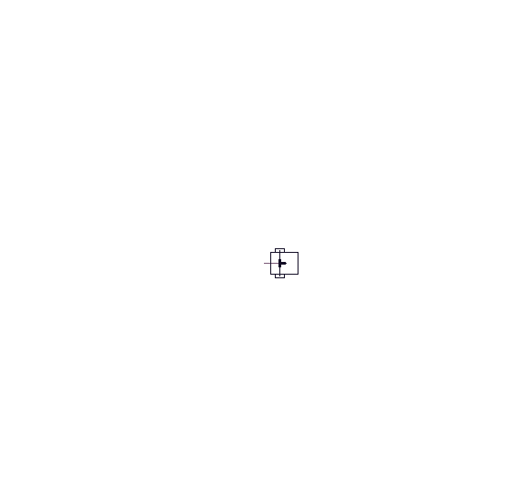](lab1/program/wmr_model.py) | [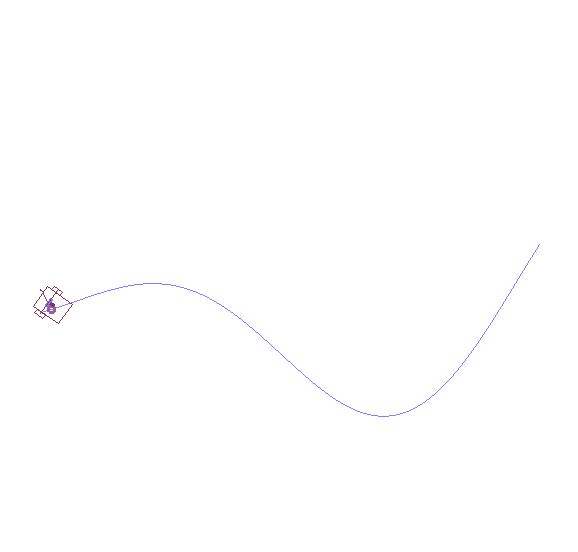](lab1/program/PathTracking/wmr_pid.py) | [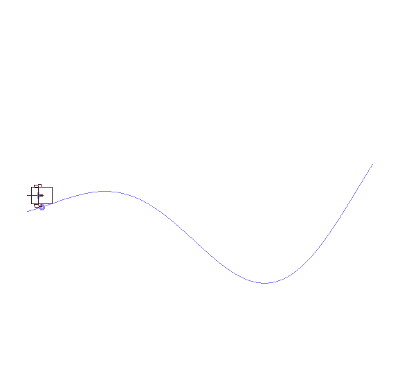](lab1/program/PathTracking/wmr_pure_pursuit.py) |

| Bicycle Model (WASD Control)                                                         | Bicycle Pure Pursuit                                                                                            | Bicycle Stanley                                                                                       |
| ------------------------------------------------------------------------------------ | --------------------------------------------------------------------------------------------------------------- | ----------------------------------------------------------------------------------------------------- |
| [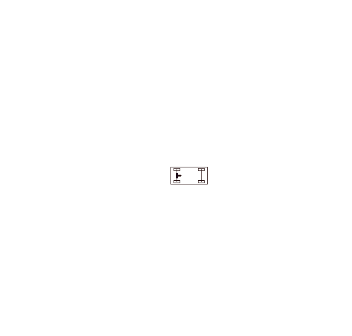](lab1/program/bicycle_model.py) | [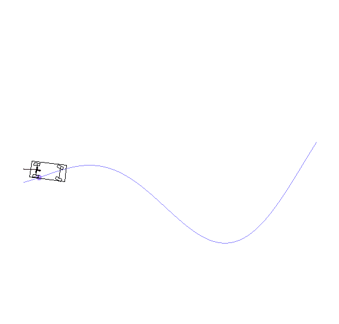](lab1/program/PathTracking/bicycle_pure_pursuit.py) | [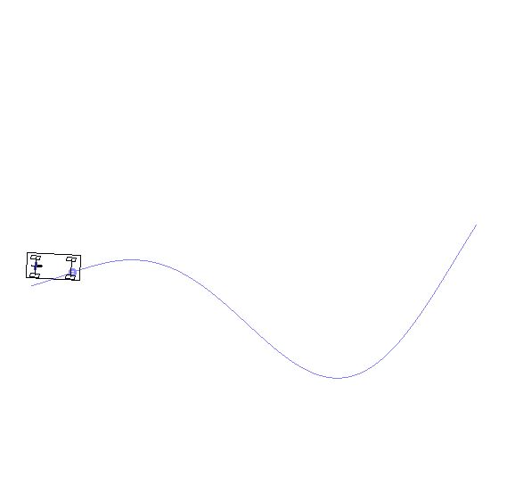](lab1/program/PathTracking/bicycle_stanley.py) |

---

### Lab 2 - Path Planning

在 Lab 2 我們要實作路徑規劃 (Path Planning) 的演算法，總共有 3 個需要實作的算法，分別為 `A* algorithm`、`RRT algorithm`，以及 `RRT* algorithm`。

- 題目要求: [lab2.pdf](lab2/lab2.pdf)
- 題目解釋: [lab2-hint.pdf](lab2/lab2_hint.pdf)
- 完整程式碼: [lab2/Program](lab2/program/)
- 成果展示 (點擊截圖查看程式碼): 

| A* algorithm                                                                          | RRT algorithm                                                                 | RRT* algorithm                                                                          |
| ------------------------------------------------------------------------------------- | ----------------------------------------------------------------------------- | --------------------------------------------------------------------------------------- |
| [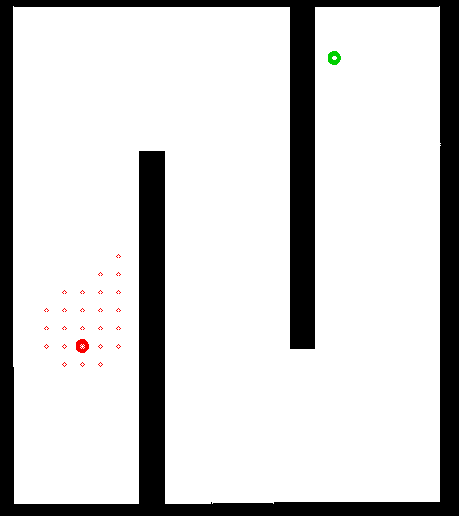](lab2/program/PathPlanning/dijkstra.py) | [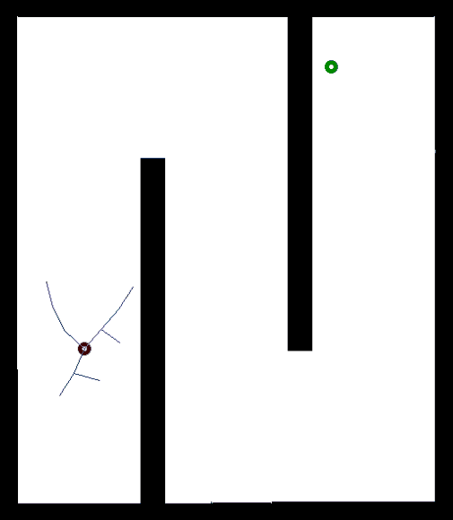](lab2/program/PathPlanning/rrt.py) | [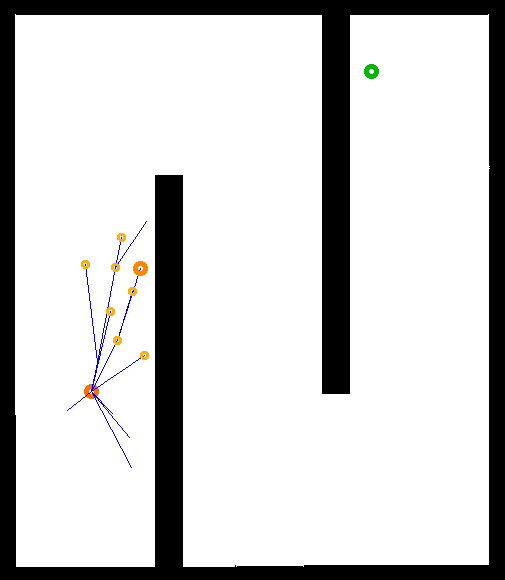](lab2/program/PathPlanning/rrt_star.py) |

---

### Lab 3 - SLAM

在 Lab 3 我們要實作 Fast-SLAM (simultaneous localization and mapping)，一種 SLAM 的變形。所謂 SLAM 是一種概念，通過車子感測器所偵測到的地標特徵，來定位車子自身的位置和狀態，一次達到定位與地圖建構的目標。

- 題目要求與解釋: [lab3.pdf](lab3/lab3.pdf)
- 完整程式碼: [lab3/Program](lab3/program/)
- 成果展示 (點擊截圖查看程式碼): 

| Fast SLAM                                                                        |
| -------------------------------------------------------------------------------- |
| [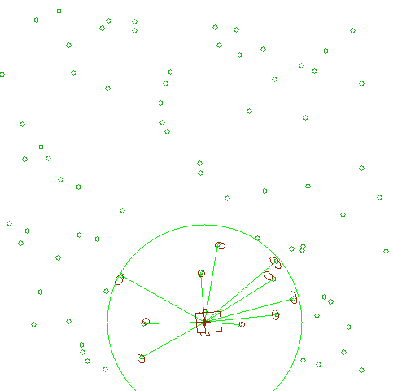](lab3/program/fast_slam_lab.py) |

---

### Lab 4

### Lab 5

### Lab 6

---

## NVIDIA JetBot

### Simulation

### Real World Model

---

## Contributing

Contributions are what make the open source community such an amazing place to be learn, inspire, and create. Any contributions you make are **greatly appreciated**.

1. Fork the Project
2. Create your Feature Branch (`git checkout -b feature/AmazingFeature`)
3. Commit your Changes (`git commit -m 'Add some AmazingFeature'`)
4. Push to the Branch (`git push origin feature/AmazingFeature`)
5. Open a Pull Request

## License

Distributed under the MIT License. See [LICENSE](https://github.com/windsuzu/Robotic-Navigation/blob/main/LICENSE) for more information.

## Contact

Reach out to the maintainer at one of the following places:

* [GitHub discussions](https://github.com/windsuzu/Robotic-Navigation/discussions)
* The email which is located [in GitHub profile](https://github.com/windsuzu)

[contributors-shield]: https://img.shields.io/github/contributors/windsuzu/Robotic-Navigation.svg?style=for-the-badge
[contributors-url]: https://github.com/windsuzu/Robotic-Navigation/graphs/contributors
[issues-shield]: https://img.shields.io/github/issues/windsuzu/Robotic-Navigation.svg?style=for-the-badge
[issues-url]: https://github.com/windsuzu/Robotic-Navigation/issues
[license-shield]: https://img.shields.io/github/license/windsuzu/Robotic-Navigation.svg?style=for-the-badge&label=license
[license-url]: https://github.com/windsuzu/Robotic-Navigation/blob/main/LICENSE.txt
[linkedin-shield]: https://img.shields.io/badge/-LinkedIn-black.svg?style=for-the-badge&logo=linkedin&colorB=555
[linkedin-url]: https://linkedin.com/in/windsuzu
[pr-welcome-shield]: https://shields.io/badge/PRs-Welcome-ff69b4?style=for-the-badge
[author-shield]: https://shields.io/badge/Made_with_%E2%9D%A4_by-windsuzu-F4A92F?style=for-the-badge
[author-url]: https://github.com/windsuzu