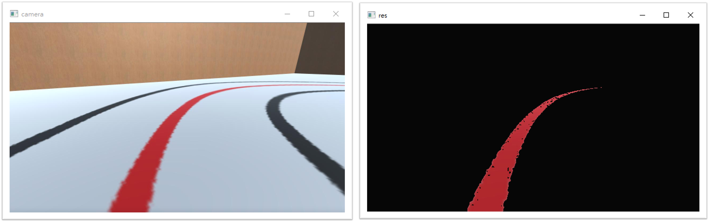
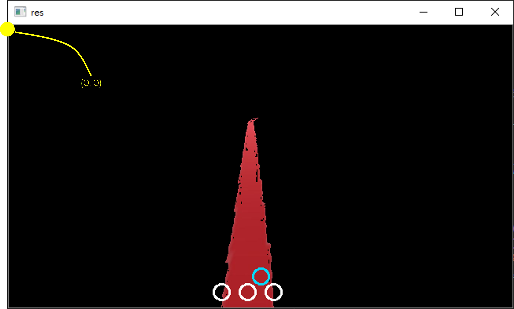
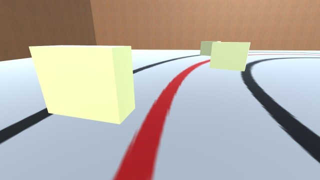
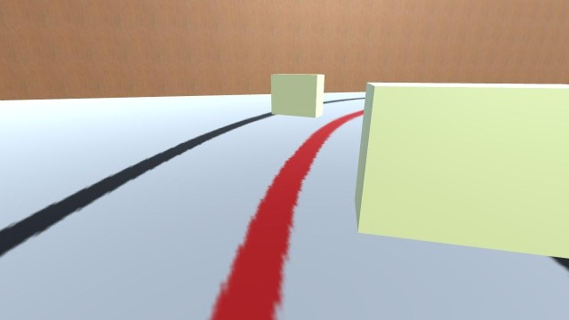
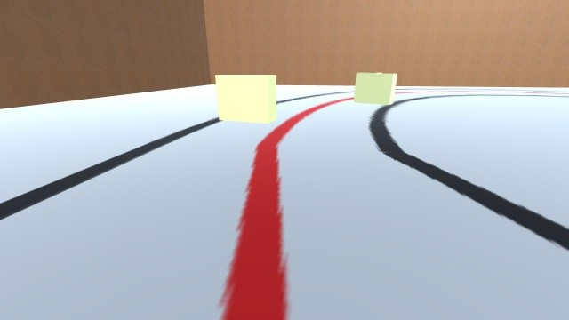

# Simulation

模擬部分可以分為 Automatic Tracking 以及 Avoidance 兩個實作部分。

* [Simulation](#simulation)
  * [Automatic Tracking](#automatic-tracking)
    * [Distinguish the red line](#distinguish-the-red-line)
    * [Distance Measurement](#distance-measurement)
    * [Direction Adjustment](#direction-adjustment)
  * [Avoidance](#avoidance)
    * [Data Collection and Labeling](#data-collection-and-labeling)
    * [Model Training](#model-training)
    * [Realtime Detection](#realtime-detection)
    * [Avoidance Method](#avoidance-method)

## Automatic Tracking

Automatic Tracking 可以分為三大部分:

1. 找出紅線
2. 計算紅線與 jetbot 照相機中央的距離
3. 條整 jetbot 的方向與速度

### Distinguish the red line

<p align="center">
    
</p>

1. 首先從 `example.py` 的範例中我們可以取得 jetbot 相機返回的照片
2. 將照片從 BGR 轉換成 HSV
3. 定義紅色的範圍
4. 根據範圍從相片取得 mask
5. 萃取出只有紅線的圖片 (`res`)

``` python
img = cv2.resize(change["new"], (640, 360))

hsv = cv2.cvtColor(img, cv2.COLOR_BGR2HSV)

lower_red = np.array([37, 148, 58])
upper_red = np.array([255, 255, 236])

mask = cv2.inRange(hsv, lower_red, upper_red)
res = cv2.bitwise_and(img, img, (mask = mask))

cv2.imshow("camera", img)
cv2.imshow("res", res)
```

### Distance Measurement

<p align="center">
    
</p>

1. 從剛剛的紅線可以用 `findNonZero()` 取出所有 pixel
   1. 會是一個 (7000+, 1, 2) 的 `ndarray`
   2. 代表七千多個 (x, y)
2. 我們取出"最左"與"最右"兩個點，並算出紅線的中間點 (`line_mean`)
3. 接著就可以算出 jetbot 螢幕中央和紅線的偏差值

``` python
coord = cv2.findNonZero(mask)
left = np.min(coord, axis=0)
right = np.max(coord, axis=0)

line_mean = int(np.mean([left[0][0], right[0][0]]))
dist = 320 - line_mean

cv2.circle(res, (320, 320), 10,(255,215,0), 2)
cv2.circle(res, (left[0][0], 340), 10, (255, 255, 255), 2)
cv2.circle(res, (right[0][0], 340), 10, (255, 255, 255), 2)
cv2.circle(res, (line_mean, 340), 10, (255, 255,255), 2)
```

### Direction Adjustment

Jetbot 可以根據與紅線的偏差改變行進角度及速度

1. 當偏離在 -20 至 20 之間時，讓 jetbot 保持前進
2. 當偏離大於 20 時，代表紅線在左，需要向左轉動
3. 當偏離小於 -20 時，代表紅線在右，需要向右轉動

``` python
if dist >= -20 and dist <= 20:
    robot.forward(0.2)
elif dist > 20:
    robot.left(0.002 * dist)
else:
    robot.right(0.002 * -dist)
```

## Avoidance

### Data Collection and Labeling

讓 jetbot 下去跑，每 10 frames 抓一張圖

``` python
if frames % 10 == 0:
    cv2.imwrite('dataset/{}.jpg'.format(frames), img)
```

將照片分成三類

1. 障礙物在左 (共 18 張)
2. 障礙物在右 (共 33 張)
3. 沒有障礙物 (共 91 張)

```
|- dataset
    |- blocked_left
    |- blocked_right
    |- free
```

| blocked_left                                  | blocked_right                                  | free                                  |
| --------------------------------------------- | ---------------------------------------------- | ------------------------------------- |
|  |  |  |

### Model Training

利用 jetbot 的 notebooks 的 `collision_avoidance.ipynb` 來進行修改，訓練一個 3 labels 的 classification model

1. 圖片 input 改為 (640, 360)
2. 改為 10 張圖片作為 testing，其餘用於 training
3. 使用 pretrained Alexnet
4. Output = 3
5. 總是存取最後一次的 model

``` python
dataset = datasets.ImageFolder(
    'dataset',
    transforms.Compose([
        transforms.ColorJitter(0.1, 0.1, 0.1, 0.1),
        transforms.Resize((640, 360)),
        transforms.ToTensor(),
        transforms.Normalize([0.485, 0.456, 0.406], [0.229, 0.224, 0.225])
    ])
)

train_dataset, test_dataset = torch.utils.data.random_split(
    dataset, [len(dataset) - 10, 10])

model = models.alexnet(pretrained=True)
model.classifier[6] = torch.nn.Linear(model.classifier[6].in_features, 3)
device = torch.device('cuda')
model = model.to(device)
```

### Realtime Detection

對每張進來的照片進行預測，得到 3 維的向量

1. 0 代表障礙物在左
2. 1 代表障礙物在右
3. 2 代表都沒障礙，可以直行

``` python
model = torchvision.models.alexnet(pretrained=False)
model.classifier[6] = torch.nn.Linear(model.classifier[6].in_features, 3)
model.load_state_dict(torch.load('best_avoidance_model.pth'))

device = torch.device('cuda')
model = model.to(device)

img = cv2.resize(change["new"], (640, 360))
x = preprocess(img)
y = model(x)
y = F.softmax(y, dim=1)  # tensor([[0.0013, 0.0180, 0.9807]])
```

### Avoidance Method

當偵測到障礙物時 (在預測的 y 中最大，且機率在 75% 以上) 就暫停 30 幀，用來進行迴避

``` python
blocked_left = 0
blocked_right = 0

if i != 2 and prob > 0.75:
    if i == 0:
        print("block left detected")
        blocked_left += 30
    elif i == 1:
        print("block right detected")
        blocked_right += 30
```

在這 30 幀裡面:

1. 前面 6 幀先後退
2. 中間 12 幀往障礙物反方向走
3. 最後 12 幀往紅線方向回去

``` python
if blocked_left > 0:
    if blocked_left > 24:
        robot.backward(0.15)
    elif blocked_left > 12:
        robot.set_motor(0.25, 0.18)
    else:
        robot.set_motor(0.18, 0.25)
    blocked_left -= 1

elif blocked_right > 0:
    if blocked_right > 24:
        robot.backward(0.15)
    elif blocked_right > 12:
        robot.set_motor(0.18, 0.25)
    else:
        robot.set_motor(0.25, 0.18)
    blocked_right -= 1
```